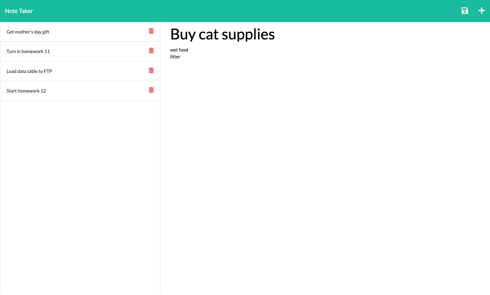

# note-taker
A small business owner wants to be able to write and save notes so that they can organize thoughts and keep track of tasks they need to complete.
## Description
1. When the user opens Note Taker, they are presented with a landing page with a link to a notes page.
2. When they click on the link to the notes page, they are presented with a page with existing notes listed in the left-hand column, plus empty fields to enter a new note title and the note’s text in the right-hand column.
3. When they enter a new note title and the note’s text, then a Save icon appears in the navigation at the top of the page.
4. When they click on the Save icon, then the new note they have entered is saved and appears in the left-hand column with the other existing notes.
5. When they click on an existing note in the list in the left-hand column, then that note appears in the right-hand column.
6. When they click on the Write icon in the navigation at the top of the page, then they are presented with empty fields to enter a new note title and the note’s text in the right-hand column.
7. When they click on a Delete icon for a note in the list in the left-hand column, then that note is removed from the list.
# Screenshot of Browser

# Link to Deployed Page
https://agile-forest-14677.herokuapp.com/notes

